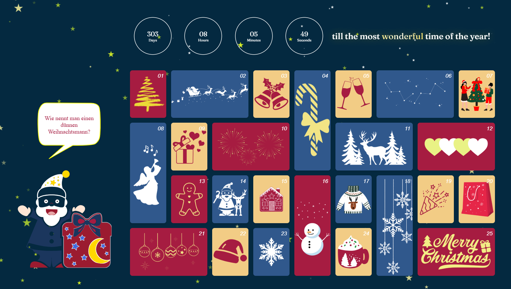

# Advent Calendar

###### **by Mahdi Ghasemi**

An interactive advent calendar built with HTML, CSS, and vanilla JavaScript.

## Technologies

- HTML5
- CSS3
- Vanilla JavaScript (no frameworks)

## Installation

1. Clone this repository
2. open the "Advent-Calendar" folder in the VS Code and go live.

## Usage

- Click on the gift box next to Santa to get the next joke.
- Click on the circle of Santa's hat to change the language, english and german availabe.
- Hover with your mouse on the speech bubble to see the answer.

## Status

🚧 **Under Construction** 🚧

## Preview

